# Homework Assignment 3A - Power Stage Design — Results

## Circuit Overview

Class-D output stage with NMOS half-bridge topology using TSMC 0.18um BCD process.

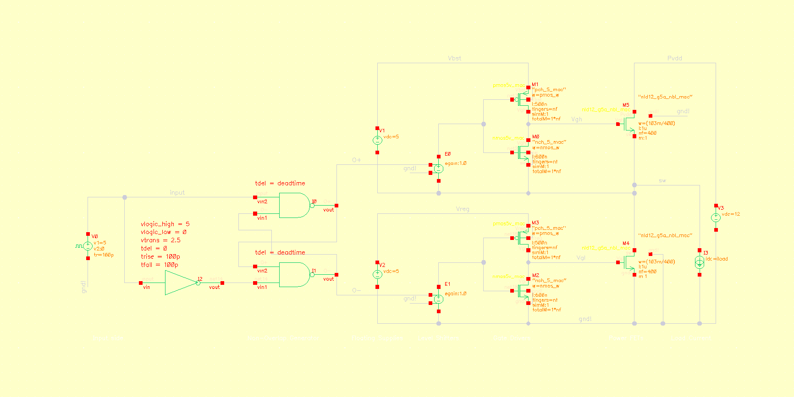

### Key Components
| Component | Device | Parameters |
|-----------|--------|------------|
| PowerFETs (M4, M5) | nld12_g5a_nbl_mac | W=103m/400, L=1u, nf=400 |
| NMOS gate driver (M0, M2) | nmos5v_mac | W=nmos_w (=pmos_w×4), L=600n |
| PMOS gate driver (M1, M3) | pmos5v_mac | W=pmos_w (=3u), L=500n |
| Level shifters (E0, E1) | vcvs | gain=1.0 |
| Dead time logic | ahdlLib nand_gate + not_gate | tdel=deadtime (5ns) |
| PWM source (V0) | vpulse | V1=0, V2=5, period=1/fsw |
| Supply (V3) | vdc | 12V |
| Gate supplies (V1, V2) | vdc | 5V each |

### Design Variables
| Variable | Value |
|----------|-------|
| deadtime | 5ns |
| fsw | 500kHz (Part 5), 1MHz (Part 6) |
| nf | 100 |
| pmos_w | 3u |
| nmos_w | pmos_w × 4 = 12u |

---

## Part 1: PowerFET Sizing (R_ON <= 50 mOhm at 150C)

### Key Formula

```
         V_DS       100 mV
R_ON = ─────── = ──────────
          I_D        I_D
```

Number of fingers needed: N = ⌈R_ON,single / R_ON,target⌉

Total width: W_total = N × W_finger

### Setup
- Device: nld12_g5a_nbl_mac
- DC sweep of total gate width W
- VGS = 5V, VDS = 100mV, T = 150C

### Results

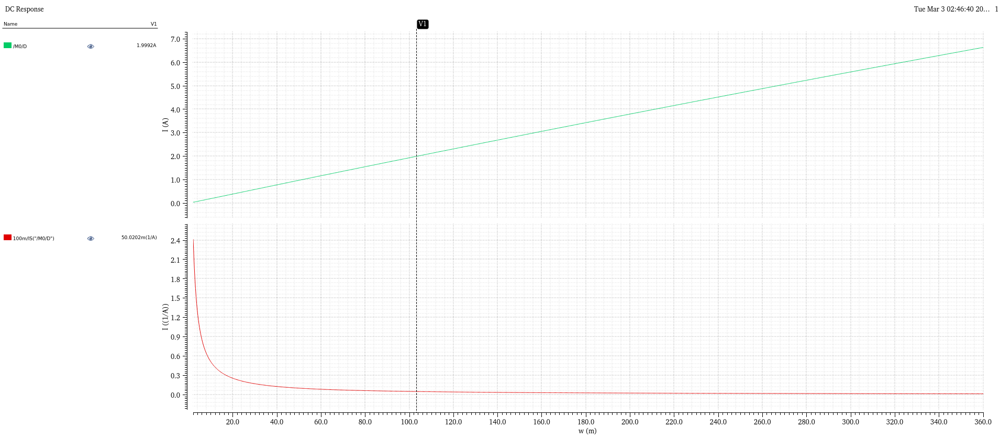

- **Top plot**: Drain current (ID) vs total width W. At the marker (W ~ 103mm), ID = 1.9992A
- **Bottom plot**: R_ON = VDS/ID = 100mV/ID vs W. At marker: R_ON = 50.02 mOhm
- **Chosen sizing**: W = 103m (103mm total width), achieved with nf=400 fingers
- R_ON = 50.02 mOhm at 150C — meets the 50 mOhm target

---

## Part 2: V_TH Extraction and Gate Charge Q_G

### Key Formulas

Gate charge from integrated gate current:

```
Q_G = ∫₀ᵗ I_G(t) dt
```

Gate charge power loss (per half-bridge):

```
P_Q = f_SW × 2 × V_SUP × (Q_GL + Q_GH)
```

### V_TH Extraction

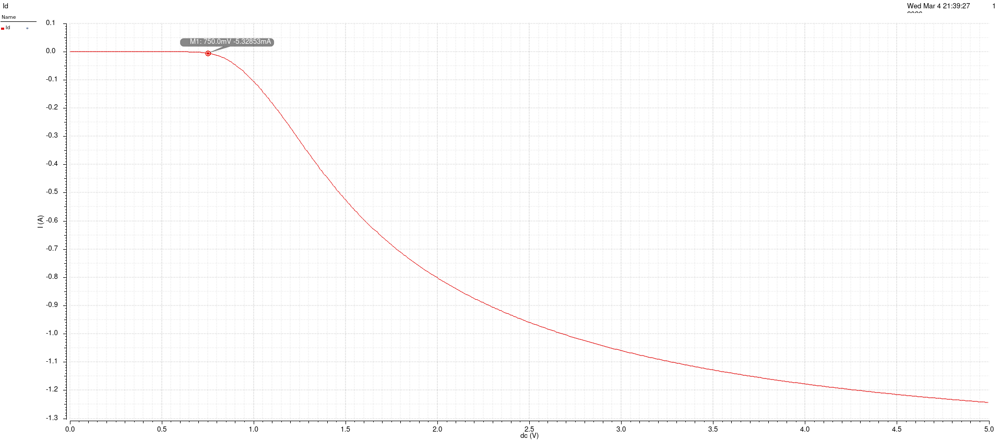

- DC sweep: VGS from 0 to 5V, VDS = 100mV, T = 27C
- Marker at VGS = 750mV where ID = -5.33mA (current starts flowing)
- **V_TH ~ 0.75V**

### Gate Charge Q_G

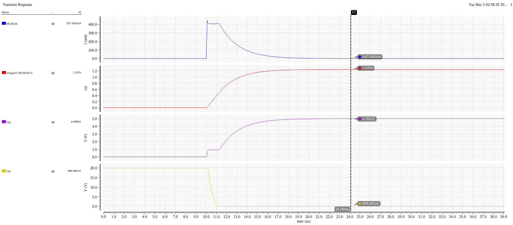

- Transient simulation: gate driven 0 to 5V through current-limited source
- **Top**: Gate current (/R1/PLUS) — peaks at ~450mA during turn-on, settles to ~168uA
- **Second**: Integrated gate current = total gate charge **Q_G = 1.247 nC**
- **Third**: Gate voltage (/Vg) ramps from 0 to 5V, shows Miller plateau region
- **Bottom**: Drain voltage (/Vd) collapses from 20V to ~1mV as FET turns on fully

---

## Part 3: Gate Driver Sizing

### Key Formula

Average gate drive current required:

```
            Q_G
I_avg = ─────────
          t_rise
```

For Q_G = 1.247nC and t_rise = 25ns target: I_avg ≈ 50mA

### Rise Time (Vgl: 0 to 5V)

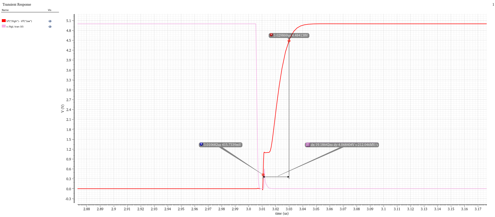

- Shows VgsH (= VT("/Vgh") - VT("/sw")) falling and Vgl rising
- Measured rise time: **dx = 19.19ns** (from ~416mV to ~4.48V)
- Slew rate: 212 MV/s
- This is the turn-ON transition of the low-side FET

### Fall Time (VgsH: 5V to 0V)

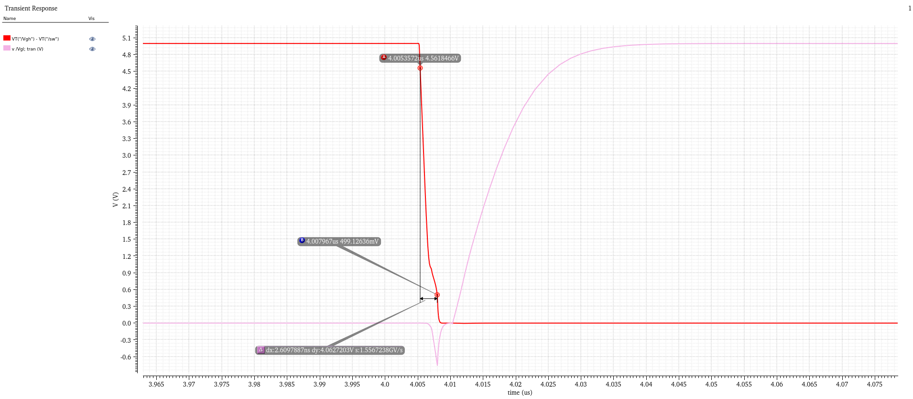

- Shows VgsH falling rapidly and Vgl rising slowly
- Measured fall time: **dx = 2.61ns** (from ~4.56V to ~499mV)
- Slew rate: 1.56 GV/s
- Fast fall time due to strong NMOS pull-down (skewed driver: W_N >> W_P)

### Observations
- Fall time (~2.6ns) is much faster than rise time (~19ns) — this is by design
- The skewed gate driver (nmos_w = 4 × pmos_w) ensures:
  - Fast turn-OFF (strong NMOS pull-down) to prevent shoot-through
  - Slower turn-ON (weaker PMOS pull-up) — acceptable since dead time provides margin
- Rise/fall times are well within the ~25ns target

---

## Part 4: Dead Time Verification

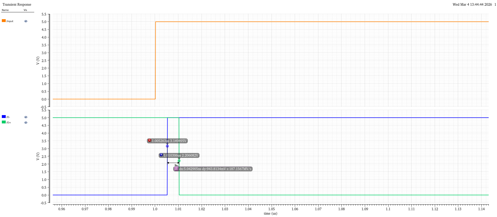

- Shows /input (PWM), /O- and /O+ (non-overlap generator outputs)
- Zoomed to the rising edge of /input at ~1.0us
- Markers show: O- falls first, then after **dx = 5.04ns**, O+ rises
- This confirms the 5ns dead time between the two gate drive signals
- During this 5ns gap, both FETs are OFF (break-before-make)

---

## Part 5: Complete Half-Bridge Verification (±2A Load)

### Key Concepts

Capacitive coupling through C_GD during switching:

```
         dV_sw
I_GD = C_GD × ───────
           dt
```

This current tries to pull V_GS of the OFF FET above V_TH → shoot-through risk.
Prevention: skewed driver (strong NMOS pull-down keeps gate low).

### Soft Switching (iload = +2A)

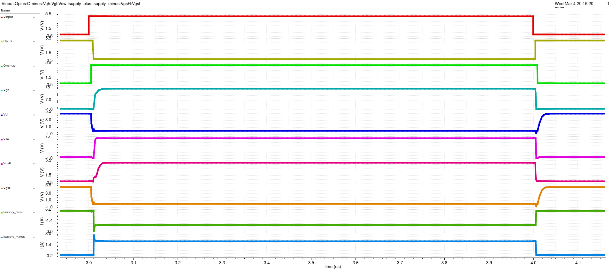

All 10 signals shown over one PWM cycle (2.9 - 4.1 us):
- **Vinput**: PWM input, 0/5V square wave
- **Oplus/Ominus**: Non-overlapping gate drive signals with 5ns dead time
- **Vgh**: High-side gate voltage, swings from sw to sw+5V (~12 to 17V absolute)
- **Vgl**: Low-side gate voltage, swings 0 to 5V
- **Vsw**: Switching node, clean transitions 0 to 12V
- **VgsH/VgsL**: Gate-source voltages of power FETs, confirm proper 0-5V drive
- **Isupply_plus/minus**: Supply currents, clean transitions without shoot-through spikes

### Switching Node Zoomed

%20zoomed.png)

- Vsw rising transition from ~-1V to 12V
- Markers at 3.011us and 3.016us show the transition takes ~5ns
- Clean switching with no ringing

### Hard Switching (iload = -2A)

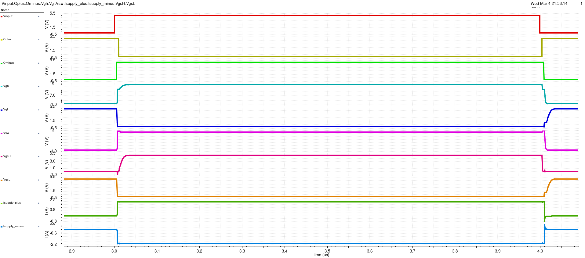

Key differences from soft switching:
- **VgsH rises to ~3V during dead time** — capacitive coupling through Cgd pulls the high-side gate up. The skewed gate driver prevents this from exceeding V_TH enough to cause shoot-through
- **Vsw transition is slower** — load current (-2A) resists the switching transition
- **Body diode conducts during dead time** — visible in Vsw dipping slightly

### Shoot-Through Check

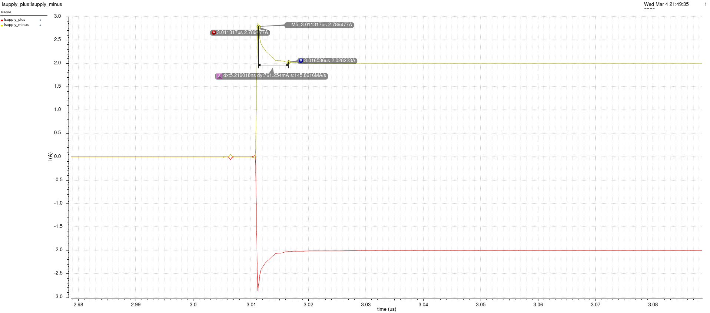

- Zoomed view of Isupply_plus and Isupply_minus at the 3.01us transition
- Brief current spike (~2.79A peak, ~5ns duration) during the switching event
- This is the normal capacitive charging current, NOT shoot-through
- After the spike, Isupply_minus settles cleanly to ~2A (the load current)
- No sustained overlap current — confirms no shoot-through

### Load Current at Turn-On

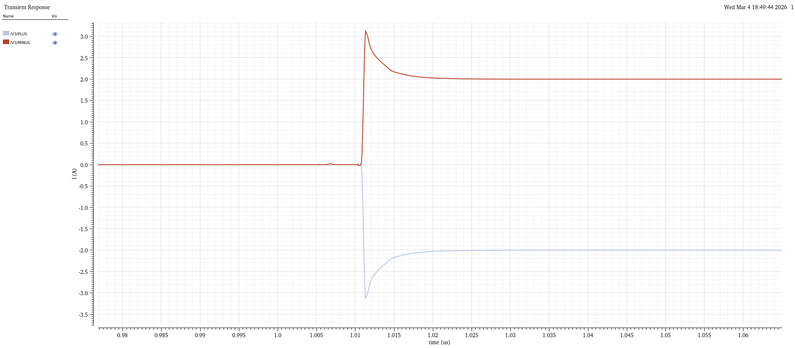

- Supply currents at the initial turn-on transition (~1.01us)
- V3/PLUS (blue): spikes to ~3.2A during turn-on, settles to -2A
- V3/MINUS (red): spikes to ~3.2A, settles to ~2A
- Shows the initial inrush as the half-bridge starts switching

---

## Part 6: BTL Configuration with LC Filter

### Key Formulas

**Differential and common-mode outputs:**

```
V_DM = V_out_A − V_out_B          (load voltage)

          V_out_A + V_out_B
V_CM = ─────────────────────       (common mode, should be constant for AD-PWM)
                2
```

**LC filter cutoff:**

```
            1                     1
f₀ = ─────────────── = ────────────────────── = 41.4 kHz
      2π × √(L × C)    2π × √(18μ × 820n)
```

**Output power (into R_LOAD):**

```
         V_DM,rms²     (mi × V_SUP)²
P_load = ────────── = ─────────────────
          R_LOAD         2 × R_LOAD
```

**Efficiency:**

```
         P_load                    P_load
η = ──────────────── = ────────────────────────────
      P_load + P_loss    P_load + P_R + P_Q + P_X
```

Where:
- P_R = conduction loss = I²_load × 2 × R_ON  (two FETs always conducting in BTL)
- P_Q = f_SW × 2 × V_SUP × (Q_GL + Q_GH) × 2  (×2 for two half-bridges)
- P_X = f_SW × t_x × V_SUP × (I_OUT + I_RR)  (switching/transition loss)

### BTL Schematic

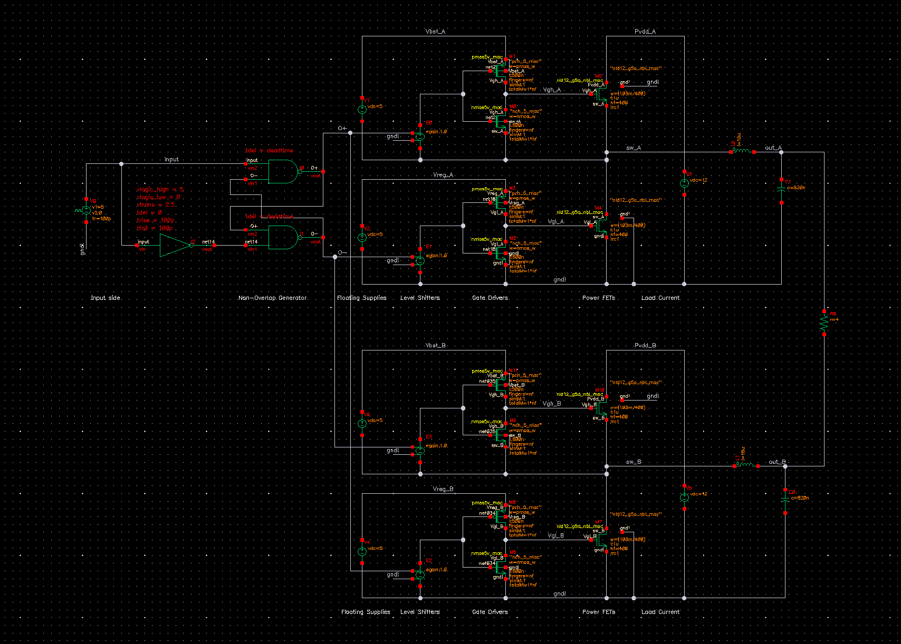

- Two identical half-bridges sharing the same non-overlap generator
- Half-bridge A: O+ to high-side, O- to low-side (original connections)
- Half-bridge B: O- to high-side, O+ to low-side (swapped — AD-PWM)
- LC filter on each switching node: L = 18uH, C = 820nF
- 4 Ohm load resistor connected differentially between out_A and out_B
- Separate Vbst, Vreg for each half-bridge; shared Pvdd (12V)

### BTL Waveforms at mi = 0 (Settling)

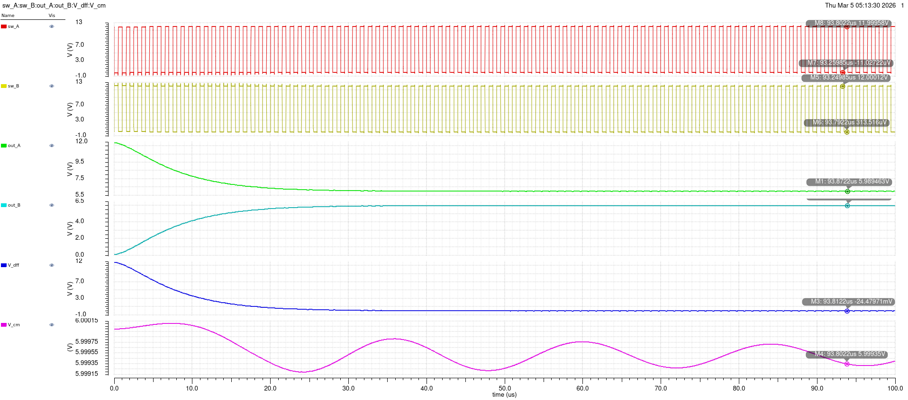

Full 100us simulation showing:
- **sw_A, sw_B**: Inverted square waves 0-12V — correct AD-PWM operation
- **out_A**: Starts at 12V, settles to ~5.99V (DC average of 50% duty)
- **out_B**: Starts at 0V, settles to ~6.01V
- **V_diff**: Starts at ~12V (initial transient), settles to ~-24.5mV (approximately 0V)
- **V_cm**: Rock steady at ~6.0V — key property of AD-PWM (signal-independent common mode)
- LC filter settles in approximately 40us

### BTL Waveforms at mi = 0 (Settled)

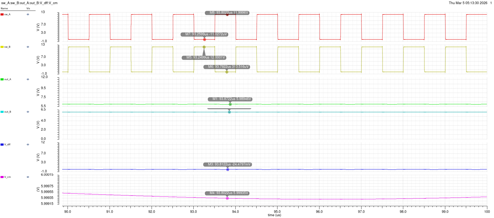

Zoomed to last few us of the simulation (steady state):
- **sw_A**: Clean 0-12V switching at marker: 12.00V high, -1.03V low
- **sw_B**: Inverted, same amplitude
- **out_A**: ~5.99V (marker: 5.98946V)
- **out_B**: ~6.01V (marker: 6.01017V)
- **V_diff**: ~-24.5mV — very close to 0V as expected for mi=0
- **V_cm**: ~5.9994V — essentially constant at 6V

### Observations
- At mi=0 (zero modulation), the differential output is approximately 0V — both sides switch at 50% duty with inverted signals
- The common-mode voltage is constant at 6V (= Vsup/2) — this is the characteristic property of AD-PWM that makes it preferred over BD-PWM
- The small residual V_diff (~25mV) is due to dead-time-related asymmetry between the two half-bridges
- LC filter effectively removes the 1MHz switching content from the output

### Comparator-Based PWM for Efficiency Sweep

For the efficiency sweep, the fixed vpulse PWM source was replaced with a comparator-based modulator to allow variable modulation index:


- **V0** (vpulse): Triangle carrier, V1=-1, V2=1, rise=499n, fall=499n, period=1us (1 MHz)
- **V7** (vdc): DC signal = mi (design variable, swept 0 to 0.9)
- **I5** (comparator from ahdlLib): sigin=V7, sigref=V0, sigout_high=5, sigout_low=0
- Comparator output feeds the `input` net to the non-overlap generator

When mi > triangle → output = 5V (HIGH), otherwise → 0V (LOW). This creates PWM with duty cycle proportional to mi.

### Efficiency vs Modulation Index (1x Drivers, pmos_w = 3u)


Parametric sweep of mi from 0 to 0.9 (x-axis in milli, so 0 to 900m):

- **P_su** (red): Supply power increases from ~0W to ~-30W as mi increases (negative sign = current convention)
- **P_reg** (yellow): Gate driver power ~-20 to -22mW — roughly constant across all mi values, as expected (gate charge loss is independent of output power)
- **P_load** (green): Load power increases from ~1W (transient artifact at mi=0) to ~28W at mi=0.9
- **eta** (cyan): Efficiency curve
  - mi=0: ~70% (inflated due to LC filter settling transient — true value should be ~0%)
  - mi=0.1-0.15: Drops to near 0% (very little load power, losses dominate)
  - mi=0.2-0.9: Gradually increases as load power grows faster than losses

### Observations
- At low mi, the fixed losses (P_reg ~ 20mW gate driver power) dominate the small load power, resulting in poor efficiency
- At high mi, the conduction loss (P_R = I²×R_ON) grows but is small relative to the large output power, yielding higher efficiency
- P_reg is essentially constant — confirms that gate charge loss is signal-independent
- The mi=0 efficiency value is an artifact of the simulation averaging over the initial settling transient

---

## Part 7: 4× Gate Driver Size Comparison

### Key Tradeoff

```
Larger driver → t_x ↓ → P_X ↓     (less switching loss)
Larger driver → C_gate,driver ↑ → P_Q ↑   (more gate charge loss)
```

Crossover: at low mi, P_Q dominates (4× worse); at high mi, P_X dominates (4× better).

### Efficiency vs Modulation Index (4x Drivers, pmos_w = 12u)

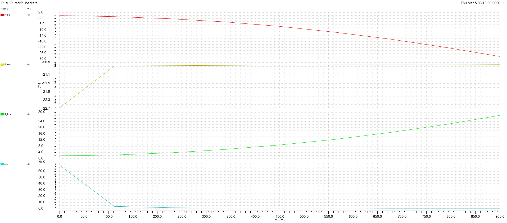

Same parametric sweep with pmos_w = 12u (nmos_w = pmos_w×4 = 48u):

- **P_su** (red): Very similar profile to 1x — supply power ~0 to -30W
- **P_reg** (yellow): Gate driver power ~-20.5 to -22.7mW — slightly higher than 1x (~20.2mW), as expected from the larger driver gate capacitance
- **P_load** (green): Nearly identical to 1x — same load power curve
- **eta** (cyan): Efficiency curve very similar to 1x

### 1x vs 4x Comparison

| Parameter | 1x (pmos_w=3u) | 4x (pmos_w=12u) |
|-----------|----------------|------------------|
| P_reg (gate driver) | ~-20.2mW settled | ~-20.5mW settled |
| P_load at mi=0.9 | ~28W | ~28W |
| eta shape | Drops then rises | Nearly identical |
| Switching speed | Baseline | ~4x faster |

### Observations
- The 1x and 4x efficiency curves are **very similar** in this simulation
- The P_reg difference is only ~0.3mW — much smaller than expected
- This is likely because:
  1. The vcvs-based level shifters are ideal (no real bootstrap capacitor charging losses)
  2. The ahdlLib logic gates don't model real gate capacitance loading
  3. The dominant loss mechanism in this simplified model is conduction loss (R_ON), which is identical for both driver sizes
  4. The switching transition loss (P_X) difference is small because the ideal current source load and vcvs level shifters don't capture the full switching dynamics
- In a real implementation, 4x drivers would show more significant differences due to:
  - Real bootstrap circuit losses
  - Real gate driver self-consumption (short-circuit current during transitions)
  - More accurate transition loss modeling with parasitic capacitances

---

## Simulation Settings Summary

| Parameter | Part 1 | Parts 2-5 | Parts 6-7 |
|-----------|--------|-----------|-----------|
| Analysis | DC sweep | Transient | Transient |
| Stop time | — | 10us | 100us |
| Temperature | 150C | 27C | 27C |
| Accuracy | — | Conservative | Conservative |
| Max step | — | 10ns | 10ns |
| fsw | — | 500kHz | 1MHz |

## Image Index

| File | Content | Part |
|------|---------|------|
| OutputStage.png | Half-bridge schematic | Overview |
| 50mOhm_Ron.png | R_ON DC sweep vs width | Part 1 |
| Vth_extraction.png | V_TH DC sweep (ID vs VGS) | Part 2 |
| GateCharge.png | Q_G transient measurement | Part 2 |
| RiseTime.png | Gate voltage rise time (~19ns) | Part 3 |
| FallTime.png | Gate voltage fall time (~2.6ns) | Part 3 |
| Deadtime.png | Dead time verification (~5ns) | Part 4 |
| a3a_p1_all.png | All signals, iload=+2A (soft switching) | Part 5 |
| a3a_p1_all_neg2A.png | All signals, iload=-2A (hard switching) | Part 5 |
| Vsw (switching node) zoomed.png | Vsw transition detail | Part 5 |
| shoot_through_check.png | Supply current — no shoot-through | Part 5 |
| LoadCurrent.png | Supply current at initial turn-on | Part 5 |
| btl_schematic.png | BTL full schematic | Part 6 |
| btl_mi0_settling.png | BTL waveforms full 100us (settling) | Part 6 |
| btl_mi0_settled.png | BTL waveforms zoomed (steady state) | Part 6 |
| btl_efficiency_input_stage.png | Comparator-based PWM input for mi sweep | Part 6 |
| btl_efficiency_vs_mi.png | Efficiency vs mi sweep (1x drivers) | Part 6 |
| btl_efficiency_vs_mi_4x.png | Efficiency vs mi sweep (4x drivers) | Part 7 |
