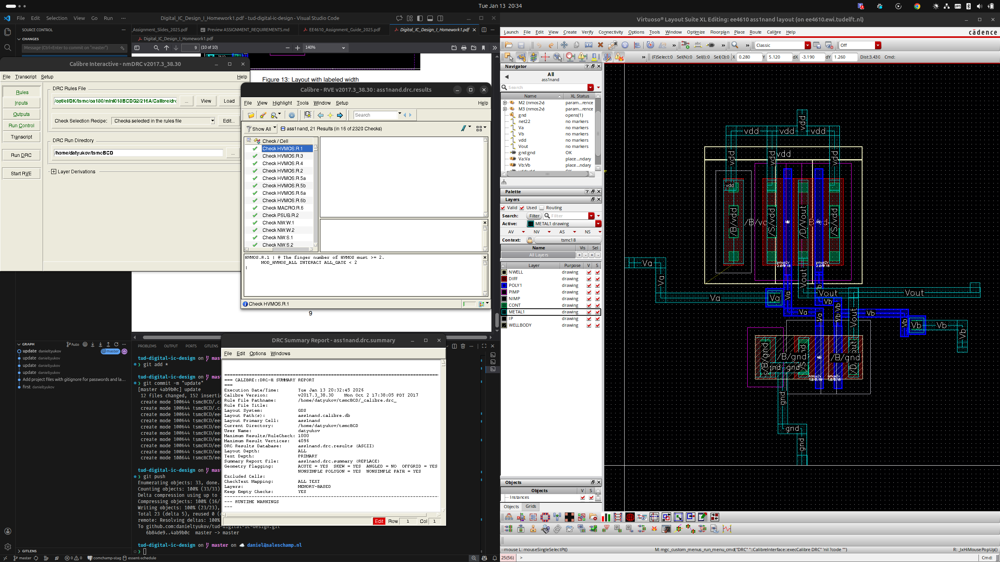
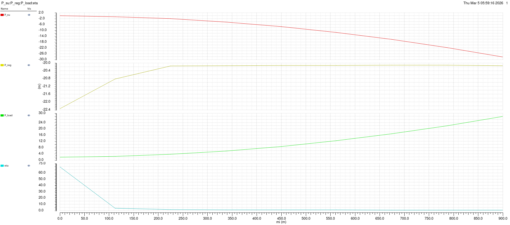
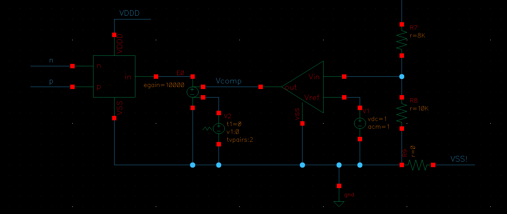

# Cadence Courses: Digital IC Design I and Power Conversion in CMOS

Two TU Delft courses that share one Cadence environment and the TSMC 180 nm BCD PDK: EE4610 (Digital IC Design I) and ET4382 (Power Conversion Techniques in CMOS Technology). The repository carries the launch and mount scripts, the PDK/DRC decks (`tsmcBCD/`), the OpenAccess design libraries, and per-assignment reports and figures.

## EE4610: Digital IC Design I

Full schematic-to-layout flow for standard-cell gates in Cadence Virtuoso on the TSMC BCD process: draw the schematic, size the transistors, lay out the cell, and sign it off with a clean Calibre DRC. Cells built include a NAND2 and the AND/OR/XOR/adder set (`tsmcBCD/ee4610/`).

The schematic and layout report examples, assignment guides, and final transistor sizing are in `EE4610/`.

## ET4382: Power Conversion Techniques in CMOS

Three converter topics, each a set of Cadence simulations with a presented report:

### Class-D audio amplifier (`class-d/`, assignments 1 to 3)
PWM modulator design and Bode analysis, output spectra versus modulation index and input frequency, LC output filter ripple, and a bridge-tied-load (BTL) output stage with dead-time, gate-charge, rise/fall, shoot-through, and efficiency-versus-modulation-index analysis.

### Switched-capacitor power converter (`scpc/`, assignments 4 to 5)
Output voltage and equivalent output resistance in the slow-switching and fast-switching limits (SSL/FSL) across switching frequency.

### Switched-mode power converter (`smpc/`, assignments 6 to 7 + final)
Buck converter design: duty-cycle and efficiency/ripple/conduction-loss calculations, compensator and loop-gain Bode design, steady-state output ripple, line-step PSRR, and a closed-loop feedback design verified in transient from 10 μA to 10 mA load.

## Repository layout

| Path | Contents |
| --- | --- |
| `EE4610/` | Digital IC Design I: assignment guides, reports, sizing, DRC result |
| `ET4382/class-d/` | Class-D amplifier assignments, schematics, spectra, efficiency |
| `ET4382/scpc/` | Switched-capacitor converter assignments |
| `ET4382/smpc/` | Switched-mode converter assignments and final buck project |
| `tsmcBCD/` | TSMC BCD PDK, Calibre DRC/LVS decks, OpenAccess libraries |
| `launch-cadence*.sh`, `mount-tsmcBCD.sh`, `register-library-EE4610.sh` | Environment setup helpers |

Tools: Cadence Virtuoso (schematic, ADE Explorer, Layout Suite XL), Calibre DRC/LVS, TSMC 180 nm BCD PDK. Presentation decks are generated with the `make_presentation.py` scripts.
